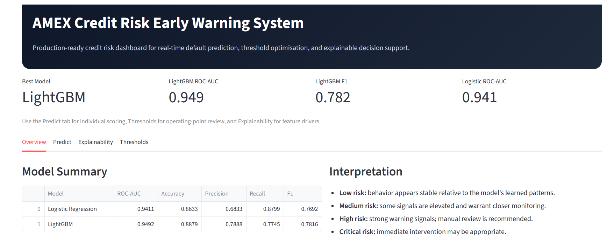

# AMEX Credit Risk Early Warning System

## Overview
This project builds an **end-to-end credit risk prediction system** using the American Express default dataset.

The system identifies customers at high risk of default and enables **proactive risk monitoring** through:
- Scalable Data Storage in **Google BigQuery**
- SQL-based Feature Engineering
- Machine Learning modelling using **LightGBM**
- Deployable Prediction Services via FastAPI
- Interactive Dashboard using Streamlit

```md
**Tech Stack:** BigQuery, SQL, Python, LightGBM, FastAPI, Streamlit
```
## Feature Engineering

Feature engineering is performed in BigQuery using SQL and includes:

- **Aggregation features:** mean, min, max, std
- **Temporal features:** latest, first, delta (trend)
- **Missingness features:** null counts and percentages
- **Behavioural signals:** range and volatility
- **History features:** number of statements and time span

These features capture both customer behaviour and temporal patterns.

## Model Choice

Two models were evaluated:

- Logistic Regression (baseline)
- LightGBM (final model)

LightGBM was selected because:

- superior performance on tabular data
- handles missing values effectively
- captures non-linear relationships
- efficient training on large datasets

Final model: **LightGBM**

## Results
| Model               | ROC-AUC   | Accuracy  | Precision | Recall | F1        |
| ------------------- | --------- | --------- | --------- | ------ | --------- |
| Logistic Regression | 0.941     | 0.863     | 0.683     | 0.880  | 0.769     |
| LightGBM            | **0.949** | **0.888** | **0.789** | 0.774  | **0.782** |

**Best Model: LightGBM**

*Threshold Insights*
- Lower threshold → higher recall (catch more risky customers)
- Higher threshold → higher precision (reduce false alarms)
- Optimal balance around 0.40 – 0.50

## Business Value

This system can be used to:
- Identify high-risk customers early
- Support credit decisioning
- Optimise risk thresholds based on business goals
- Enable risk segmentation (Low / Medium / High / Critical)

## Architecture
```test
Raw Data (CSV)
   ↓
Google BigQuery (raw tables)
   ↓
SQL Feature Engineering
   ↓
model_dataset_v2
   ↓
Python Training Pipeline (src/train.py)
   ↓
Model Artifacts (models/)
   ↓
FastAPI (prediction service)
   ↓
Streamlit Dashboard (UI)
```
## Project Structure
```md
```test
amex_credit_risk/
├── data/
│   ├── raw/
│   ├── interim/
│   └── processed/
├── models/                     # trained models + artifacts
├── notebooks/                  # exploration + validation
├── sql/                        # feature engineering pipeline
├── src/                        # training + prediction logic
├── api/                        # FastAPI app
├── app/                        # Streamlit dashboard
├── reports/
│   └── figures/
├── tests/
├── .gitignore
├── README.md
└── requirements.txt
```
### How to Run Locally

1. Train the model
```bash
python -m src.train
```
2. Run FastAPI
```bash
uvicorn api.main:app --reload
```
API docs:
```bash
http://127.0.0.1:8000/docs
```
3. Run the Streamlit Dashboard
```bash
streamlit run app/streamlit_app.py
```

## Testing

Run tests using:

```bash
pytest

## Key Features
- End-to-end ML pipeline (data → model → API → UI)
- BigQuery-based scalable feature engineering
- LightGBM high-performance model
- Threshold tuning for business use cases
- Risk band classification:
    - Low
    - Medium
    - High
    - Critical
- Feature importance for explainability

## 📸 Dashboard Preview

### 🔹 Overview

<p align="center">
  
</p>

---

### 🔹 Threshold Tuning

<p align="center">
  
</p>

---

### 🔹 Feature Importance

<p align="center">
  
</p>

## Future Improvements
- SHAP-based explainability
- Batch prediction pipeline
- Model versioning (MLflow or GCP)
- CI/CD integration
- Cloud deployment (Streamlit Cloud / Render)

## Author
**Daniel Diala**
[GitHub Portfolio](https://github.com/dd4real2k)

```md
## 📄 License

This project is licensed under the MIT License.
